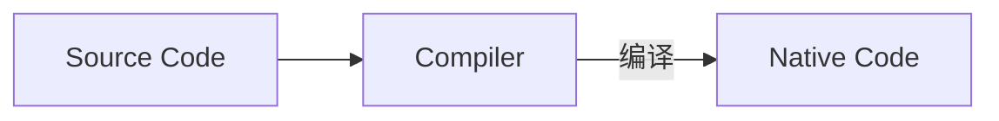

## 开篇

开一个坑，重新学习 C 语言，将自己学习过程记录下来。C 语言是一门面向过程的编程语言，是将问题拆分成若干个小问题分步骤进行解决编程模式。

## 编译器

| 编译器名称 | 说明                                                             | 官网                                                  |
| :--------: | :--------------------------------------------------------------- | :---------------------------------------------------- |
|    GCC     | GNU Compile Collection 缩写，是开源社区 GNU 开发维护的编译工具集 | https://www.gnu.org/software/gcc/                     |
|   Clang    | LLVM 苹果出的编译工具链，友好的错误提示信息，建议使用            | https://clang.llvm.org/                               |
|    MSVC    | 微软出的 C\++编译器，只兼容 C\++支持 C 语言的特性                | https://visualstudio.microsoft.com/zh-hans/downloads/ |

学习 C 语言建议选择 Linux，不建议 Windows 系统。当然可以使用[WSL](https://docs.microsoft.com/zh-cn/windows/wsl/install-win10)

C 语言从源代码到机器码流程图：



C 语言的第一个程序 hello world

```c
#include <stdio.h>
#include <stdlib.h>
//version 1
int main(void) {
  printf("Hello, world\n");
  return EXIT_SUCCESS;
}
// version 2
int main(int argc, char *argv[]) {
  printf("Hello, world\n");
  return EXIT_SUCCESS;
}
```

`#include <stdio.h>`是预处理语句，`#include`的作用是引用 C 语言标准库中的 stdio 库，作用和 python 中的 import、C#中的 using 一样。

`printf("Hello, world\n");`是调用`stdio`库中的`printf`函数输出字符串`Hello, world`。

C 语言必须有一个 main 函数，作为程序启动入口，当然也只能有一个。`main`函数的签名在 C 标准中只有两种写法，其他的写法均是不符合标准的。

## Clang/GCC

> clang/gcc main.c -o main  
> 执行编译好的文件  
> ./main  
> 可以得到结果  
> Hello, world

## Visual Studio

安装 C++开发选项后，新建项目-选择语言 C++-控制台应用


修改 main.cpp 为 main.c，并修改项目属性中 C 标准为 C17


并将上面的代码写入到 main.c 中，点击本地调试器按钮或者 F5/Ctrl+F5 快捷键，均能看到运行结果。


## IDE 和手敲命令

Visual Studio 等 IDE 本质上也是运行编译器命令生成相应的程序，只是为开发者自动去完成手巧命令过程，这样有好处也有坏处。好处就是这样可以让程序员能够专注于代码的逻辑和不用去繁琐敲击命令；坏处就是因为 IDE 帮助程序员执行了编译命令，没有了一套完成编译-链接-生成逻辑链，对程序员来说当出现比较底层的问题时，便无从下手解决。  
无论哪一种方式，作为程序员都应该花时间去了解整个编译链工作原理。

## 总结

在这一章节，我们主要介绍了 C 语言的基础知识，让大家有一个大概的轮廓，到底 C 语言是一个什么东西，它主要用来做什么以及怎么做。
