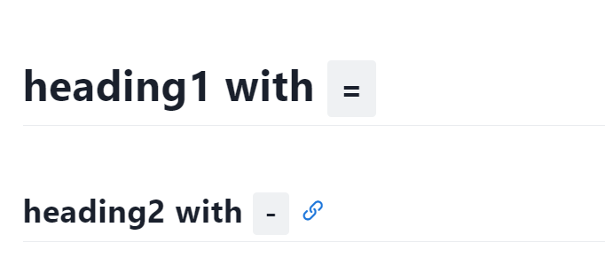
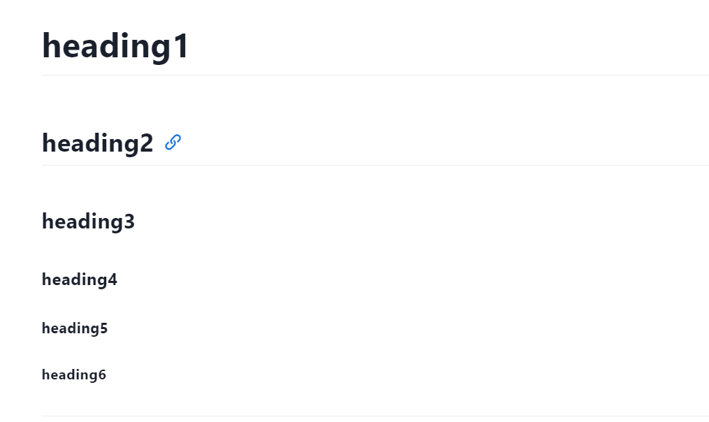

## Heading

### Use `-/=` 

we can use `-/=` tag to specify a heading. `-` represents the two level heading and `=` represents the one level heading. There are only two levels heading with this way.

```markdown
heading1 with `-`
--

heading2 with `=`
==
```



### Use `#`

We can address the limitations of the previous method by using `#` tag. The number of  `#` represents the rank of heading. This way supports up to 6 levels of headings.  

```markdown
# heading1 

## heading2

### heading3

#### heading4

##### heading5

###### heading6
```




## Bold and Italic

### Bold

We can use `**content**` or `__content__` to strength some contents. (Recommend `****` tag)

**Strength with `****`**  

__Strength with `____`__  

### Italic

We can use `*content*` or `_content_` to strength some contents. (Recommend `**` tag)

*Strength with `**`*  

_Strength with `__`_  

## List

### Unordered List

Use `-/+/* content`

- first
- second
- third

+ first
+ second
+ third

* first
* second
* third

### Ordered List

Use `number. content`

1. first
2. second
3. third

### List Levels

Use 
```markdown
+ content1
    + content2
        + content3

+ content1
    + content2
        1. sub1
        2. sub2
```

+ content1
    + content2
        + content3

+ content1
    + content 2
      + content2.1
          1. sub1
          2. sub2
      + content2.2
          1. sub1
          2. sub2